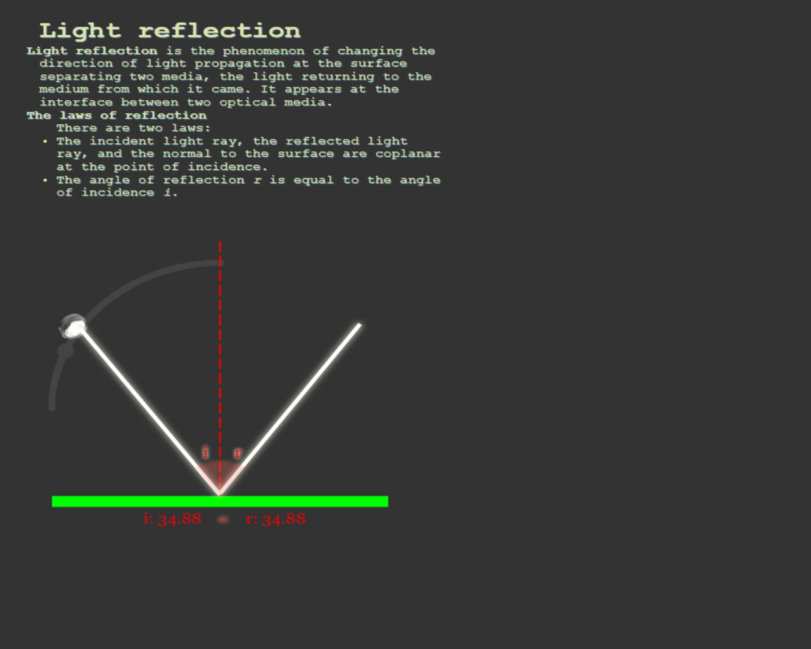
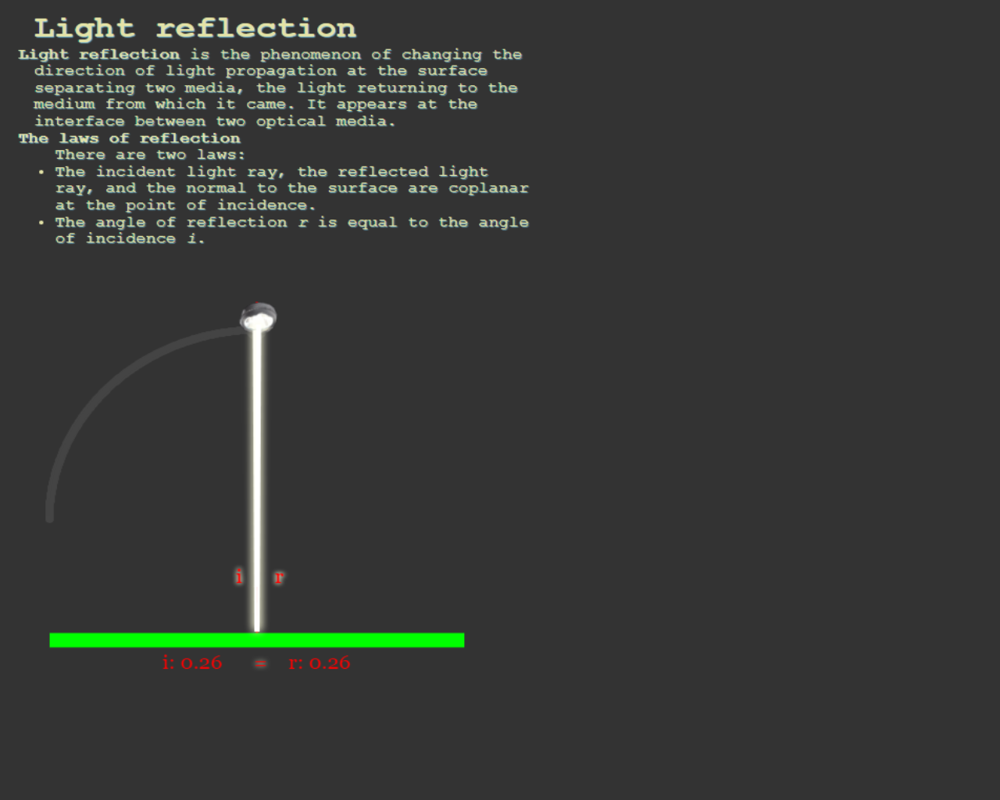
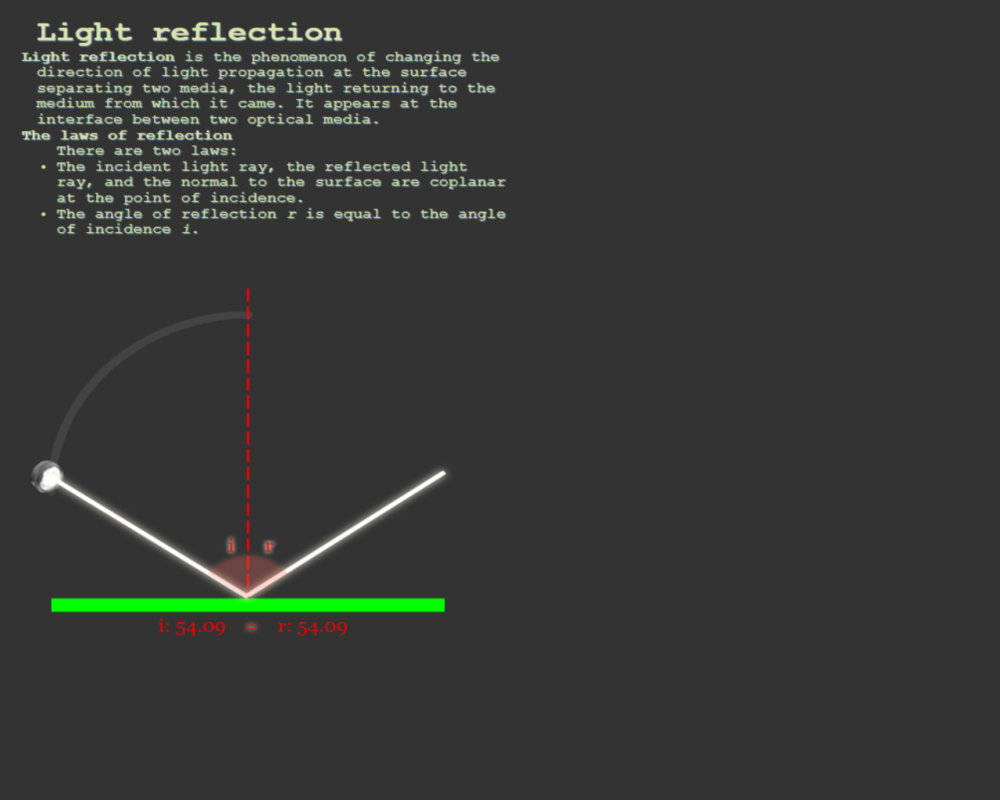

# Light Reflection using Canvas animation

I built this project to deepen my knowledge of JavaScript using Canvas
This project is currently in development. This is an e-learning model. The light reflection is represented by an animation using canvas

## Screenshots

## Tech Stack

- HTML
- CSS
- JAVASCRIPT
  - Canvas
    

## Authors

- [Augustin](https://github.com/Gusty-programmer)

    

## License

This project is licensed under the [Augustin] License - see the LICENSE file for details
